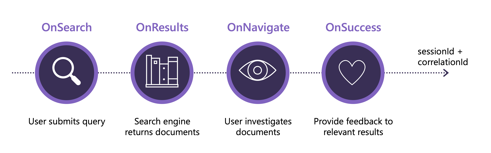
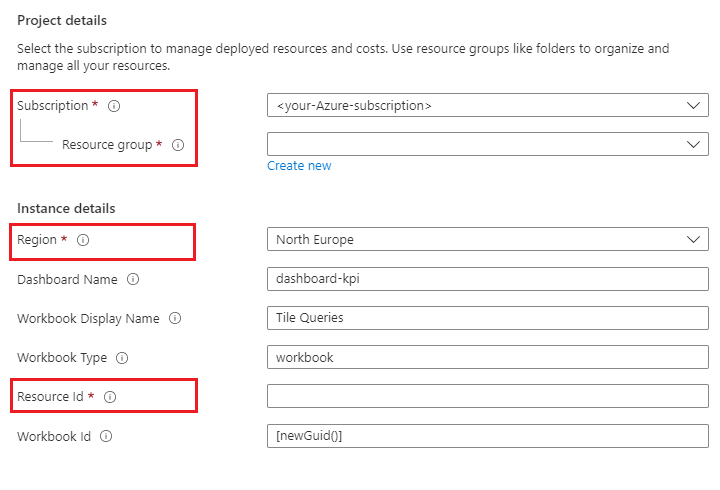

# Query performance dashboard for monitoring Cognitive Search using Application Insights


This Application Insights sample demonstrates an approach for deep monitoring of query usage and performance of an Azure Cognitive Search index. It includes a JSON template that creates a workbook and dashboard in Application Insights and a Jupyter Notebook that populates the dashboard with simulated data.

In this sample, you'll perform the following steps:

1. Deploy an Application Insights ARM template, creating a dashboard that visualizes usage and performance of the search engine.
1. Generate synthetic data that simulates user events and send the data to Application Insights.
1. View the query performance dashboard in Azure portal.

Once your dashboard is in place and you understand the data structures, you can adapt the solution to incorporate your real-world data.

This code is a collaborative effort of these groups at Microsoft: Commercial Software Engineering, and Data and AI Service Line. Huge thanks to [@dupuyjs](https://github.com/dupuyjs) for setting up the ARM template and providing deployment expertise.

## Prerequisites

* Azure subscription - [Create one for free](https://azure.microsoft.com/free/).
* [Azure Application Insights](https://docs.microsoft.com/azure/azure-monitor/app/create-new-resource)
* [Python 3.7 or later](https://www.python.org/downloads/)
* [Visual Studio Code](https://code.visualstudio.com/Download) or any Python IDE of your choice
* [Visual Studio  Code extension: Python](https://marketplace.visualstudio.com/items?itemName=ms-python.python)

A search service isn't needed because this sample uses simulated data in place of logged queries, search results, and user signals and session data. The synthetic data mimics the actual data that gets logged in Search. It also includes representations of user identity and behavior, which your app will need to capture.

Using synthetic data allows you to isolate dashboard deployment from data collection and logging issues. Once the dashboard is functional, you can swap in your logged events and user data captured by your application.

## Simulating log events

In this notebook, we'll generate fake log events using the [Faker package](https://pypi.org/project/Faker/), with the aim of simulating information retrieval user experience.

We'll simulate and log the following user events:

* *OnSearch* - The user submits a query of interest into the system. Additional parameters are `{'query':'<your query string>'}`
* *OnResults* - A list of documents returned by your search engine. An additional parameter for each result is the rank of each document.
A rank in our case is the running index of the returned documents. The first document is ranked 1. `{'indexRank':'<document rank>'}`.
* *OnNavigate* - An event where the user navigates to a particular document for further investigation.
* *OnSuccess* - An indication that the document in question was found relative to the search query.



For the purpose of this example, we won't use the *OnResults* event for calculations.

Detailed steps can be found in the following Jupyter Notebook [app_insights_sdk_example.ipynb](notebooks/app_insights_sdk_example.ipynb).
  
## Deploy to Azure

As a first step, deploy the dashboard to your Application Insights resource. You'll select the blue button below, which prepares a [predefined ARM template](/src/arm/dashboard.template.json), and then fill in some properties. The ARM template creates the visualizations and provides the Kusto queries that explore the simulated data.

The properties you'll need to provide in the deployment page include an Azure subscription, resource group, region, and resource ID. 



To get the resource ID, sign in to the [Azure portal](https://portal.azure.com ) and find the Overview page of your Application Insights resource. In the Essentials bar at the top of the page, select **JSON View**. The Resource ID is the first property.

Click the button below when you're ready to deploy.

[](https://portal.azure.com/#create/Microsoft.Template/uri/https%3A%2F%2Fraw.githubusercontent.com%2FAzure-Samples%2Fazure-samples-search-evaluation%2Fmain%2Fsrc%2Farm%2Fdashboard.template.json)

After you fill in the deployment properties and select **Review and Create**, you'll be prompted to agree to the terms of service. Select either of the links that take you to service terms: **Azure Marketplace Terms** or **Azure Marketplace**.

Review the terms and close the page.

At this point, you can now select **Create** to execute the deployment.

After the deployment finished, you can look at the workbook on Azure, but it will be empty. You'll use the notebook to create and load the data that brings your dashboard to life.

## Set up your environment

1. Start Visual Studio Code and open the root folder of the sample.

1. Create a `.env` file and paste in the following settings. Substitute a valid instrumentation key for the placeholder string. You can get the instrumentation key from the Overview page for Application Insights in the Azure portal.

   ```ini
   API_LOGGING_LEVEL = "DEBUG"
   LOGGER_NAME = "test_logger"
   APP_INSIGHTS_KEY = "<your-application-insights-instrumentation-key>"
   ```

1. [Open the notebook](/notebooks/app_insights_sdk_example.ipynb) and follow the instructions to create and load the sample data.
